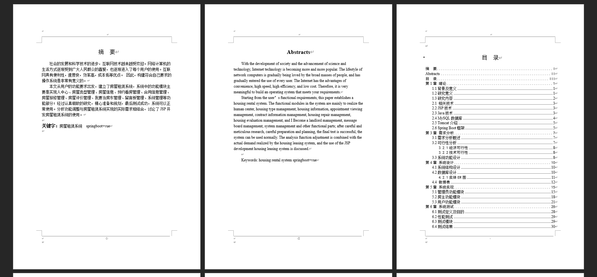
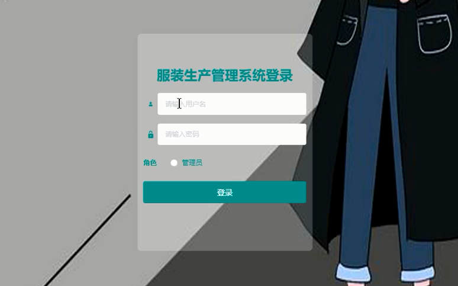
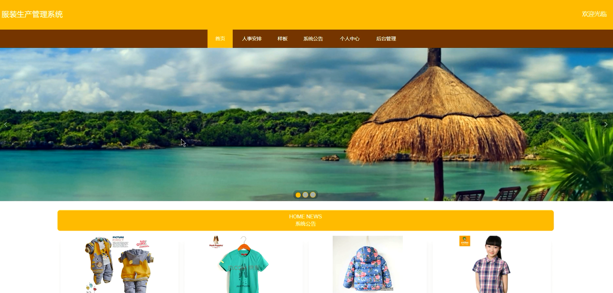
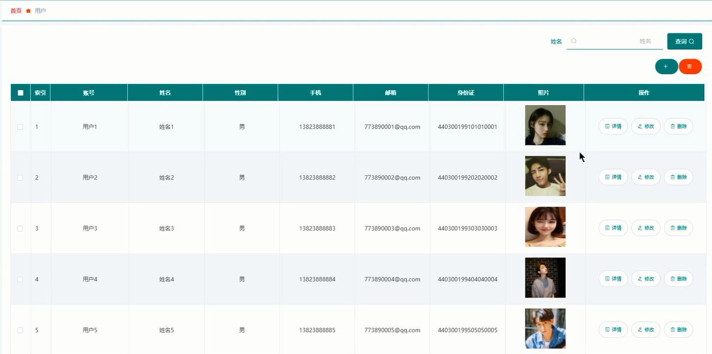
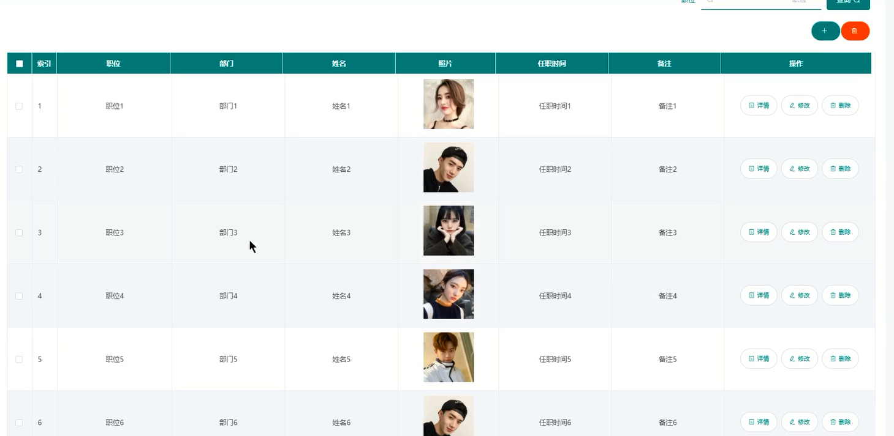
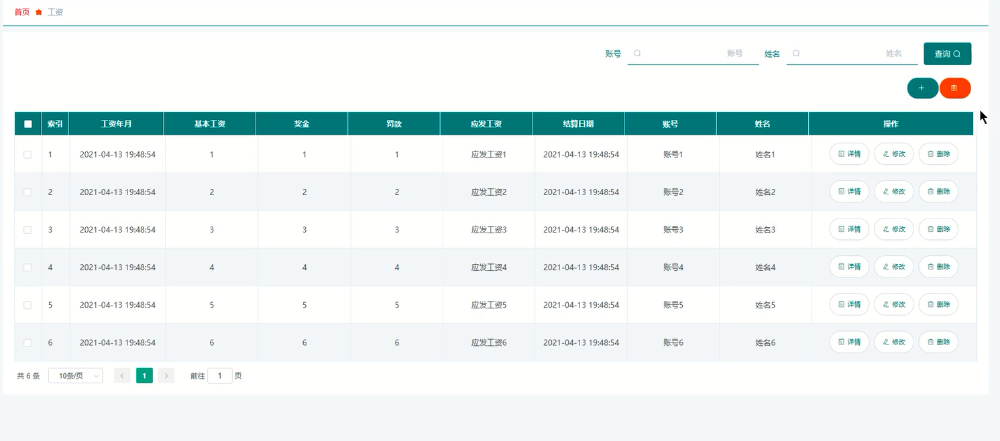
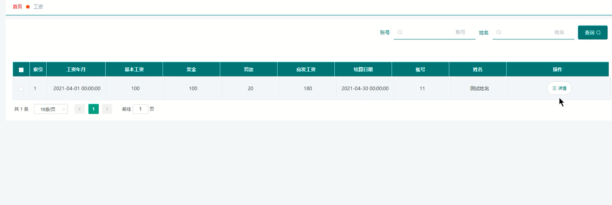
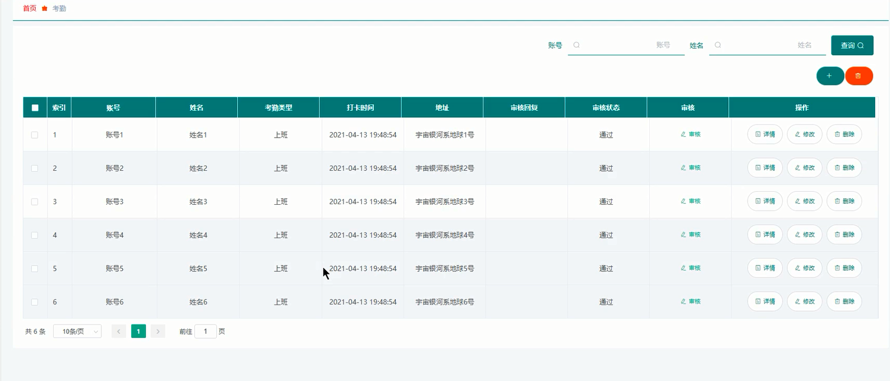
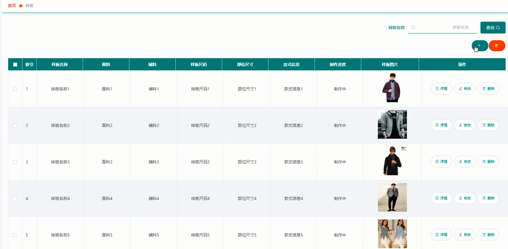

基于Springboot的服装生产管理系统（程序+论文）
=
### 完整代码获取地址：从戎源码网 ([https://armycodes.com/](https://armycodes.com/))
### 作者微信：19941326836  QQ：952045282 
### 承接计算机毕业设计、Java毕业设计、Python毕业设计、深度学习、机器学习
### 选题+开题报告+任务书+程序定制+安装调试+论文+答辩ppt 一条龙服务
### 所有选题地址https://github.com/nature924/allProject

一、项目介绍
---
系统包含两种角色：用户、管理员，系统分为前台和后台两大模块，主要功能如下：

### 登录界面的实现
用户要想进入本系统必须进行登录操作，进入对应角色登录界面，在登录界面输入系统账号、登录密码，选择登录类型，点击登录按钮进行登录系统。

### 系统主界面的实现
用户在系统前台可查看系统信息，包括首页、人事安排以及样板等。

### 用户管理模块的实现
管理员登录后可查询、添加、修改和删除用户信息。

### 人事安排管理模块的实现
管理员可增删改查人事安排信息。

### 工资管理模块的实现
管理员可增删改查工资信息，用户登录后可查看个人工资信息。

### 考勤管理模块的实现
用户登录后可添加考勤信息，管理员可查看用户添加的考勤，并可对其进行审核操作。

### 样板管理模块的实现
管理员可增删改查样板信息。

二、项目技术
---
- 编程语言：Java
- 数据库：MySQL
- 项目管理工具：Maven
- 前端技术：VUE、HTML、Jquery、Bootstrap
- 后端技术：Spring、SpringMVC、MyBatis

三、运行环境
---
- 操作系统：Windows、macOS都可以
- JDK版本：JDK1.8以上都可以
- 开发工具：IDEA、Ecplise、Myecplise都可以
- 数据库: MySQL5.7以上都可以
- Tomcat：任意版本都可以
- Maven：任意版本都可以

四、运行截图
---
### 论文截图：

### 程序截图：

